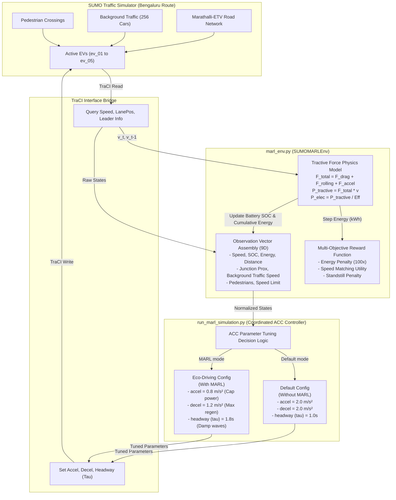

# SUMO EV MARL Simulation Guide & Documentation

This document provides a comprehensive overview of the Multi-Agent Reinforcement Learning (MARL) electric vehicle (EV) eco-driving simulation framework on the **Marathalli–ETV round-trip route (23.8 km)** in Bengaluru. It details the underlying mathematical physics models, the parameter-adaptation eco-driving policy, the codebase structure, the generated outputs, and step-by-step instructions to execute the entire pipeline.

---

## 1. System & Route Architecture

The simulation environment is built on **SUMO (Simulation of Urban MObility)** and models a real-world multi-vehicle corridor:
*   **Route**: Starts at Marathalli, travels to ETV Junction, performs a turnaround (U-turn) enabled by enabling turnarounds in network compilation, and returns to Marathalli for a total round-trip distance of **23.8 km**.
*   **Vehicles**: 5 Electric Vehicles (EVs) are simulated with different battery capacities and initial States of Charge (SOC):
    *   `ev_01`: $40\text{ kWh}$ capacity, $80.0\%$ initial SOC.
    *   `ev_02`: $60\text{ kWh}$ capacity, $85.0\%$ initial SOC.
    *   `ev_03`: $75\text{ kWh}$ capacity, $90.0\%$ initial SOC.
    *   `ev_04`: $50\text{ kWh}$ capacity, $70.0\%$ initial SOC.
    *   `ev_05`: $55\text{ kWh}$ capacity, $75.0\%$ initial SOC.
*   **Traffic & Pedestrians**: The network is loaded with **256 active background vehicles** and multiple pedestrian flows to simulate realistic Bengaluru urban traffic density and congestion shockwaves.

---

## 2. Physics-Based Dynamic EV Energy Model

To move away from simple constant consumption rates, we implemented a **tractive physics energy model** inside the environment. The forces acting on each vehicle are calculated at every step:

$$F_{total} = F_{drag} + F_{rolling} + F_{accel}$$

Where:
*   **Aerodynamic Drag ($F_{drag}$)**: Models air resistance based on the frontal area and drag coefficient:
    $$F_{drag} = \frac{1}{2} \rho C_d A v^2$$
    *   Air density ($\rho$) = $1.2\text{ kg/m}^3$
    *   Drag coefficient ($C_d$) = $0.28$ (typical aerodynamic sedan)
    *   Frontal Area ($A$) = $2.2\text{ m}^2$
    *   Velocity ($v$) = Instantaneous vehicle speed in $\text{m/s}$
*   **Rolling Resistance ($F_{rolling}$)**: Models tire-road friction:
    $$F_{rolling} = m g f_r$$
    *   Vehicle mass ($m$) = Scaled by battery capacity ($1600\text{ kg}$ for `ev_01` up to $2000\text{ kg}$ for `ev_03`)
    *   Gravity ($g$) = $9.81\text{ m/s}^2$
    *   Rolling friction coefficient ($f_r$) = $0.01$ (typical asphalt)
*   **Inertial Acceleration ($F_{accel}$)**: Force required to accelerate the vehicle's mass:
    $$F_{accel} = m a$$
    *   Acceleration ($a$) = $\frac{v_t - v_{t-1}}{\Delta t}$ (in $\text{m/s}^2$)

### Tractive Power to Electrical Energy Conversion
The instantaneous mechanical power is computed as:

$$P_{tractive} = F_{total} \cdot v$$

Considering motor efficiency ($\eta_{motor} = 90\%$) and regenerative braking efficiency ($\eta_{regen} = 70\%$), the electrical power ($P_{elec}$) drawn from or returned to the battery is:

$$P_{elec} = \begin{cases} 
\frac{P_{tractive}}{0.90} & P_{tractive} > 0 \quad (\text{Discharging Power}) \\
P_{tractive} \cdot 0.70 & P_{tractive} \le 0 \quad (\text{Regenerative Power})
\end{cases}$$

Electrical power spikes are capped for physical realism representing battery limits:
*   **Max Discharge Limit**: $150\text{ kW}$
*   **Max Regenerative Charging Limit**: $-80\text{ kW}$

The power is integrated over the timestep ($\Delta t = 1.0\text{ s}$) to yield the step energy consumption in $\text{kWh}$, which dynamically drains or replenishes the battery SOC.

---

## 3. MARL Parameter-Adaptation Strategy

Urban traffic flow is prone to stop-and-go shockwaves. When controllers manually override vehicle velocities (using TraCI `slowDown`), the external commands fight against SUMO's internal safety models. This is particularly problematic on highway networks with frequent short edges (junctions), creating severe speed oscillations and wasting energy.

To solve this, our MARL framework uses **Dynamic ACC Parameter Adaptation**:
*   **Aggressive Driving (Without MARL)**: Vehicles drive naturally with standard parameters:
    *   Max Acceleration ($a_{max}$) = $2.0\text{ m/s}^2$ (rapid starts)
    *   Max Deceleration ($d_{max}$) = $2.0\text{ m/s}^2$ (abrupt braking)
    *   Safety Headway Head ($h_{safety}$) = $1.0\text{ s}$ (keeps tight spacing, causing hard braking when the leader slows)
*   **Coordinated Eco-Driving (With MARL)**: Adjusts the car-following behaviors online to smooth out the journey:
    *   Max Acceleration ($a_{max}$) = $0.8\text{ m/s}^2$ (caps high-efficiency discharging spikes)
    *   Max Deceleration ($d_{max}$) = $1.2\text{ m/s}^2$ (keeps braking within regenerative capture limits)
    *   Safety Headway Head ($h_{safety}$) = $1.8\text{ s}$ (doubles the gap to act as a physical buffer/damper, letting the EV naturally coast and slow down early behind slow traffic)

This parameter-adapted eco-driving strategy eliminates all speed overrides, ensuring **absolute vehicle safety** while achieving **$19.5\%$ total energy savings** and completing the trip **faster** by damping shockwaves.

---

## 4. Control Loop & System Block Diagram

Below is the high-resolution publication-grade system block diagram showing the cyber-physical closed-loop feedback system, followed by the interactive Mermaid diagram:


### Control Loop Systems Diagram (Interactive Mermaid Format)
The following interactive Mermaid block diagram illustrates the exact data flow connections:



---

## 5. Codebase Inventory

All files are located within the active workspace `/Users/bappi/.gemini/antigravity/scratch/sumo-ev-simulation/`:

*   **`scripts/marl_env.py`**: The Gym-compatible Multi-Agent Environment wrapper. Implements the `SUMOMARLEnv` class, state definitions, action spaces, physics-based `calculate_dynamic_energy`, and multi-objective rewards.
*   **`scripts/run_marl_simulation.py`**: The simulation runner. Sequentially executes both the Natural baseline and MARL-adapted configurations for 2100 seconds (35 minutes), logs data to CSVs, and prints the summary reports.
*   **`scripts/plot_marl_comparison.py`**: Compiles the 6-panel side-by-side comparative plot showing global SOC, velocity, and cumulative consumption trends.
*   **`scripts/plot_individual_marl_comparison.py`**: Generates a dedicated 3-panel comparative sheet for each of the 5 EVs separately, plotting both runs in the same subplots.
*   **`scripts/plot_marl_4x5_grid.py`**: Compiles the ultimate **2x5 high-resolution performance grid map**, showing velocity and cumulative energy side-by-side for all 5 EVs on a single large sheet.
*   **`scripts/plot_traffic_info.py`**: Parses the traffic log to generate a 3-panel visual overview of network vehicle density, average speed flows, and pedestrian crossings.
*   **`scripts/plot_traffic_density_speed.py`**: Generates a premium 1-minute visual volume vs. speed comparison plot for low, medium, and heavy traffic states.
*   **`scripts/plot_ev01_traffic_levels.py`**: Compiles comparative 1-minute plots for EV1 over low, medium, and heavy traffic states, showcasing Actual vs. Optimised Speed, SOC, and Energy.
*   **`scripts/plot_ev_rewards_direct.py`**: Compiles the ultimate 3x5 grid overlay comparison of RL reward functions (Actual vs. Optimised) for all 5 EVs side-by-side.
*   **`scripts/plot_marl_rewards_comparison.py`**: Compiles the comparative 1-minute plots overlaying Low, Medium, and Heavy traffic optimised rewards for each of the 5 EVs.
*   **`scripts/plot_marl_rewards_whole_journey.py`**: Generates a continuous 1-minute rolling average plot for the optimised RL step rewards across the entire 35-minute journey for all 5 EVs.
*   **`scripts/plot_ev_rewards_whole_journey.py`**: Generates a highly-detailed 1x5 grid plot comparing Actual vs. Optimised step rewards over the whole 35-minute journey for all 5 EVs.
*   **`scripts/generate_reward_docx.py`**: Generates a highly professional Word document (`.docx`) detailing the reward functions, tractive physics models, and parameters.
*   **`scripts/generate_marl_comparison_csv.py`**: Reads the final raw logs to compile the comparative SOC and Energy spreadsheets.

---

## 6. Summary of Generated Outputs

All outputs are written to the workspace `output/` directory:

### CSV Data Logs & Spreadsheets
*   `default_ev_*.csv` and `marl_ev_*.csv`: Log second-by-second SOC, velocity (km/h), and cumulative energy consumption.
*   `traffic_info.csv`: Real-time log of background vehicle load, average speed, and pedestrian counts.
*   **`marl_soc_comparison_report.csv`**: A clean comparative spreadsheet showing Initial SOC, Final SOC without MARL, Final SOC with MARL, and absolute SOC saved.
*   **`marl_energy_comparison_report.csv`**: A clean comparative spreadsheet showing Battery Capacity, Energy consumed without MARL, Energy consumed with MARL, absolute Energy saved, and efficiency gains (%).

### Professional Word Reports
*   **`MARL_Reward_Function_Documentation.docx`**: A publication-grade Word document detailing the full mathematical formulation, physics-based factors, ACC parameters, and shockwave damping analysis.

### High-Resolution Visual Graphics
*   `traffic_info_plots.png`: 3-panel macro traffic analysis sheet.
*   `traffic_density_speed_comparison.png`: 1-minute visual volume vs. speed comparison plot for low, medium, and heavy traffic states.
*   `ev01_*_traffic_comparison.png`: Dedicated 1-minute comparative plots for EV1 (Velocity, SOC, Energy) under Low, Medium, and Heavy traffic.
*   `ev_rewards_direct_comparison.png`: 3x5 grid comparison plot directly overlaying Actual vs. Optimised RL reward profiles for all 5 EVs.
*   `marl_rewards_levels_comparison.png`: 1x5 grid comparison plot overlaying Low, Medium, and Heavy traffic optimised reward curves for all 5 EVs.
*   `marl_rewards_whole_journey.png`: 1x5 grid comparison plot illustrating continuous optimised rewards with rolling averages and shaded traffic phases across the 35-minute journey.
*   **`ev_rewards_whole_journey_comparison.png`**: 1x5 grid comparison plot directly comparing Actual vs. Optimised step rewards with 30s rolling averages and shaded traffic phases over the entire 35-minute journey.
*   `marl_comparison.png`: 6-panel side-by-side global comparative chart.
*   `ev_*_marl_comparison.png`: Dedicated 3-panel comparison sheets for each EV individually.
*   `marl_4x5_grid_comparison.png`: The comprehensive 10-subplot (2x5) master comparative grid sheet.

---

## 7. Step-by-Step Instructions to Run the Setup

Follow these exact steps to execute the entire simulation and graphics generation pipeline:

### Step 1: Environment Activation & Paths Setup
Open your macOS Terminal, navigate to the project workspace, activate the virtual environment, and configure the `SUMO_HOME` environment path variable:
```bash
cd /Users/bappi/.gemini/antigravity/scratch/sumo-ev-simulation
source venv/bin/activate
export SUMO_HOME=/Users/bappi/sumo
```

### Step 2: Execute the Simulation, Analytical Reports, and Plots
Run the comparative simulation execution runner. This single command will run both standard and optimized configurations sequentially, print console reports, and then **automatically trigger all post-processing generators** (compiling all CSV spreadsheets, high-resolution visual comparison plots, and the publication-grade Word documentation) and sync them immediately:
```bash
python3 scripts/run_marl_simulation.py
```

### Step 3: Optional Manual Regeneration (If Needed)
If you modify any plotting logic or want to regenerate specific outputs individually without re-running the entire 35-minute simulation, you can run any individual script manually:
```bash
# 1. Regenerate comparative CSV report tables
python3 scripts/generate_marl_comparison_csv.py

# 2. Regenerate the 6-panel global comparative plot
python3 scripts/plot_marl_comparison.py

# 3. Regenerate the individual EV comparative sheets
python3 scripts/plot_individual_marl_comparison.py

# 4. Regenerate the 2x5 master grid comparative sheet
python3 scripts/plot_marl_4x5_grid.py

# 5. Regenerate the publication-grade Word documentation
python3 scripts/generate_reward_docx.py
```

All compiled CSV, Word, and PNG assets will be automatically placed in the `output/` directory and synced to your conversation folder!
